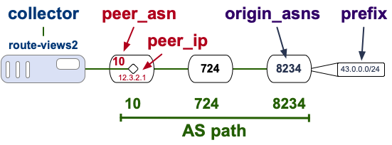

[README](README.md) | [Introduction](Introduction.md) | Datasets ⮕ | [Tasks](Tasks.md) | [Task 1](Task-count-addresses.md) | [Notebook](nids-bgp-control-plane.ipynb)

# Datasets

## BGP Routing Table (RIB) Snapshots

The notebook uses BGP Routing Information Base (RIB) snapshots collected by **RouteViews**, a University of Oregon project whose **collectors** [peer](https://archive.routeviews.org/peers//peering-status.html) with ASes around the world and archive their full routing tables. Each snapshot captures every **prefix** announcement visible from a vantage point (**peer**) at a specific moment in time.

### MRT Format

RIB files are stored in **MRT (Multi-Threaded Routing Toolkit)** format.
Each entry represents one prefix announcement and contains:

| Field           | Example      | Description                                                                       |
| --------------- | ------------ | --------------------------------------------------------------------------------- |
| **collector**   | route-views2 | Name of the collector                                                             |
| **peer_asn**    | 10           | The ASN of the vantage point                                                      |
| **peer_ip**     | 12.3.2.1     | The IP address of the vantage point                                               |
| **as_path**     | 10 724 8234  | Sequence of ASNs the route traversed                                              |
| **origin_asns** | 8234         | Last ASN in the path — the AS that originated the prefix                          |
|                 |              | When a prefix is announced by more than one origin AS, it is called a MOAS prefix |
| **prefix**      | 192.0.2.0/24 | The announced IP prefix in CIDR notation                                          |

<br/>

### bgpkit

The notebook uses **[bgpkit](https://bgpkit.com/)**, a library for parsing MRT-format BGP data. bgpkit handles decompression, MRT record parsing, and filtering, letting the notebook iterate over RIB entries as Python objects without dealing with the binary format directly.

```python
for elem in bgpkit.Parser(url=url):
    elem.collector
    elem.peer_asn
    (etc)
```

### OSDF

The notebook fetches RIB files via **OSDF (Open Science Data Federation)**, a distributed data infrastructure that provides high-speed access to large scientific datasets. The notebook handles this automatically — no manual download step is needed for the RIB data.

[ [RouteViews website](https://www.routeviews.org/) | [CAIDA BGP datasets](https://catalog.caida.org/search?query=bgp) ]

---

## CAIDA AS Customer Cone

You will download the CAIDA AS Customer Cone file (`20260501.ppdc-ases.txt.bz2`) the same way you did in _nids-asn-introduction_, and place it in the `data/` directory.

As a quick reminder, the file format is:

```
# comment lines start with #
# each data line: <root AS> <member AS1> <member AS2> ...
23 23 4 1
1 1
```

The cone size for an AS is the number of space-separated tokens on its line minus one (the first token is the AS itself). Refer to [nids-asn-introduction/Datasets.md](../../nids-asn-introduction/nids-asn-introduction/Datasets.md) for full download instructions and dataset details.

### Prefix and IP Customer Cone

We will also introduce two additional granularities of customer cone: _prefix customer cone_ and _IPv4 address customer cone_. The prefix customer cone is all of the prefixes originated by all customers in one's customer cone (without double counting within a customer cone). Similarly, the IPv4 address customer cone is all of the addresses contained in all prefixes originated by all customers in one's customer cone (without subtracting more specifics that may be announced by a different AS). Multiple ASes may have the same prefix/addresses in their prefix and address customer cones, but the same AS can only count each prefix/address once in their customer cone.

[README](README.md) | [Introduction](Introduction.md) | Datasets ⮕ | [Tasks](Tasks.md) | [Task 1](Task-count-addresses.md) | [Notebook](nids-bgp-control-plane.ipynb)
