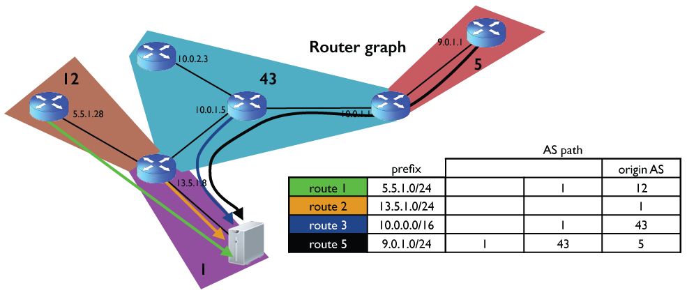
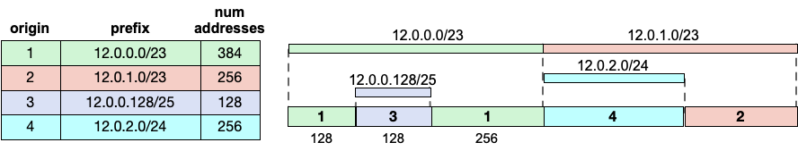

[README](README.md) | Background ⮕ | [Datasets](Datasets.md) | [Tasks](Tasks.md) | [Task 1](Task-count-addresses.md) | [Notebook](nids-bgp-control-plane.ipynb)

# Introduction and Background

### Reading

- [RouteViews Project](https://www.routeviews.org/) — the BGP data collection infrastructure used in this module
- [CAIDA BGP Datasets](https://catalog.caida.org/search?query=bgp) — CAIDA's collection of BGP-derived datasets
- [Border Gateway Protocol (Wikipedia)](https://en.wikipedia.org/wiki/Border_Gateway_Protocol)

In _nids-asn-introduction_ you explored how ASes are organized and measured by their customer cones. This module takes a closer look at **what those ASes actually do**: announce IP address space to the rest of the Internet using BGP.

**BGP (Border Gateway Protocol)** is the inter-domain routing protocol — it carries reachability information between separately operated networks. When an organization acquires a block of IP addresses (a _prefix_), their AS announces that prefix to its BGP neighbors, and the announcement propagates across the Internet so that other networks can route traffic to it.

Each BGP announcement carries an **AS path**: the ordered sequence of ASNs a route has traversed. The last ASN in the path is the **origin AS** — the AS that originated the prefix. Route collectors like **RouteViews** peer with many ASes and archive full snapshots of their routing tables, called **RIBs (Routing Information Bases)**, in **MRT format**. This makes it possible to analyze the global view of prefix origination at a point in time.

### MOAS Prefixes

Some prefixes appear in the routing table with **more than one origin AS** — these are called **MOAS (Multi-Origin AS)** prefixes. MOAS announcements can arise from legitimate configurations (e.g., a multi-homed organization announces the same block from two ASes) or from routing incidents such as prefix hijacks. Measuring the fraction of MOAS prefixes gives some insight into the stability and security of the global routing system.

### Prefix Count vs. Address Count

A natural way to measure an AS's contribution to the routing table is to count the number of prefixes it originates. However, prefixes vary enormously in size — a /8 covers 16 million addresses while a /24 covers only 256. A more meaningful metric is the **address count**: the total number of IP addresses covered by an AS's prefixes.

Address counting is not simply a matter of summing prefix sizes, because prefixes can overlap — a more-specific /24 may be nested inside a less-specific /16. The correct approach is to apply **longest-prefix-match** logic: an address is attributed to the most-specific prefix that covers it, avoiding double-counting.   In the first part of this assignment  (prefix-to-AS mapping) we will map each prefix in a routing table to the AS that originates (the most specific subnet of) that prefix, that is we will subtract address space in more-specific subnets that are originated from AS B from the address space in a corresponding less-specific prefix announced by AS A. 

### CCDF — Reading the Distribution

Because prefix and address counts span many orders of magnitude, we visualize their distributions using a **Complementary Cumulative Distribution Function (CCDF)** on a log-log scale. The CCDF at value _x_ gives the fraction of ASes that originate (prefixs or addresses) with a count _greater than or equal to x_. A steep initial drop-off shows that most ASes are small, while a long right-hand tail shows that a small number of ASes are very large. A straight line on a log-log CCDF is the signature of a **power-law distribution** — a pattern common in Internet topology measurements.

### Connecting Back to Customer Cones

In _nids-asn-introduction_ you measured a customer cone by counting ASes. In this module you will extend that idea to **prefix space**: for each AS, aggregate the prefixes announced by every AS in its customer cone. This gives a picture of how much of the Internet's address space each AS is responsible for routing, rather than just how many customer networks it serves.  In our customer cone analysis we will *not* subtract more specific subnets as we did for the prefix-to-AS mapping above. 

#### Optional Reading

- [RouteViews MRT Data Archive](https://archive.routeviews.org/) — raw BGP data files
- [CAIDA RouteViews Prefix-to-AS Dataset](https://catalog.caida.org/dataset/routeviews_prefix2as) — CAIDA's prefix-to-origin-AS mapping
- [Autonomous system (Wikipedia)](https://en.wikipedia.org/wiki/Autonomous_system_%28Internet%29)

[README](README.md) | Background ⮕ | [Datasets](Datasets.md) | [Tasks](Tasks.md) | [Task 1](Task-count-addresses.md) | [Notebook](nids-bgp-control-plane.ipynb)
